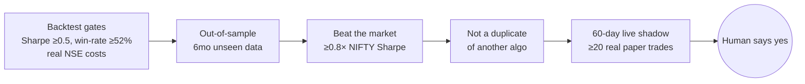

<div align="center">

# AQRTI

### An AI that researches the Indian stock market all night, and isn't allowed to lie to you about the results.

*Self-learning quant research & paper-trading terminal for NSE/BSE — built solo, running 24/7 on a desktop.*

[](https://python.org)
[](https://fastapi.tiangolo.com/)
[](https://github.com/UrMacroGuy/aqrtinet)
[](#)
[-critical.svg)](#the-honesty-gate)
[](#what-it-is)

**[The pitch](#the-pitch)** · **[See it running](#see-it-running)** · **[Proof, not promises](#proof-not-promises)** · **[How it's built](#how-its-built)** · **[Run it yourself](#run-it-yourself)**

</div>

---

## The Pitch

Every night after the NSE closes, AQRTI wakes up alone and does the work of a small quant desk: pulls prices, reads the news, retrains its ML models, breeds a new generation of trading algorithms, paper-trades the best of them, and grades its own homework — all without a human touching it.

It was built on one rule that overrides everything else: **it is never allowed to look good by accident.** No mocked data, no cherry-picked backtests, no metric that's secretly cheating. If it has nothing real to show, it says `NO DATA` instead of making something up.

That rule is the whole point. Anyone can build a backtest that shows a 90% win rate — that's a bug, not a feature. AQRTI is the harder, less flattering project: a system that tells you the truth about whether it actually has an edge, even when the truth is **currently, 0 out of 927 trading algorithms have earned the right to go live.**

---

## See It Running

<div align="center">

*Dashboard screenshots go here — Overview, Algo Lab leaderboard, and Model Center calibration curve, captured from a live run.*

`[ screenshot: Overview page — portfolio, regime, top predictions ]`
`[ screenshot: Algo Lab — leaderboard + evolution tree ]`
`[ screenshot: Model Center — walk-forward accuracy + calibration curve ]`

</div>

> These are placeholders on purpose, not filler. Consistent with the honesty rule above, a screenshot only goes in this README once it's captured from a real run showing real numbers — see [Proof, Not Promises](#proof-not-promises) for why that standard matters more here than in most projects.

---

## Proof, Not Promises

### The honesty gate

A trading algorithm doesn't go live because it looks good in one backtest. It has to survive an obstacle course, in order, with zero shortcuts:



Every threshold above lives in exactly one file, `promotion_config.py` — nothing else in the codebase is allowed to redefine them. There is no admin switch to loosen a gate when results are disappointing.

**Result as of today: 0 promoted, out of 927.** That's not a bug — it's what happens when you stop letting a system grade its own exam. In July 2026 a full audit (the "Trust Overhaul") found the *old* scoring was quietly broken — wrong transaction costs, a risk metric that hid its own volatility, a rule-checker that guessed when data was missing. Under those old, broken rules, dozens of algorithms looked ready. Rebuilt honestly, the real number is zero, and that number is reported here instead of buried.

### The model, honestly benchmarked

AQRTI's prediction engine is [**AQRTINet**](https://github.com/UrMacroGuy/aqrtinet) — a custom model, also open for anyone to read, maintained as its own repo. Two real runs, reported side by side rather than the one that looks better:

**3-year walk-forward validation, full NSE universe:**

| Model | Accuracy | AUC-ROC | Precision |
|---|---|---|---|
| CatBoost | 51.8% | 0.596 | 51.1% |
| NGBoost | 49.4% | 0.591 | 48.9% |
| **AQRTINet** | 49.0% | **0.572** | **53.1%** |

**Fast 5,000-row spot check (2026-07-06):** AQRTINet actually lost this one — 45.2% accuracy vs. CatBoost's 61.0%, because the sample happened to contain only one of its four market-regime specialists. Reported anyway, with the full caveat, [in AQRTINet's own README](https://github.com/UrMacroGuy/aqrtinet#proof-it-works) — because a project that only shows you its wins isn't one you should trust when it shows you a win.

If that looks like a strange thing to be proud of — a model that's ~50% accurate and sometimes loses to a baseline — that's the point. On 5-day stock direction, 50% is close to the theoretical ceiling; anything dramatically higher almost always means the backtest is leaking future information into the past. See the [Trust Overhaul](#the-trust-overhaul) below for what that failure mode looks like when nobody catches it.

---

## How It's Built

```
Prices, news, sentiment  →  71 engineered features  →  AQRTINet + CatBoost + NGBoost
        →  927 evolving trading algorithms  →  the honesty gate  →  paper trading  →  you
```

A 14-page browser dashboard (vanilla JS + Chart.js — deliberately no framework) sits on top of a FastAPI backend and a 93-table SQLite database. Highlights:

| Page | What it's for |
|---|---|
| **Overview** | Portfolio value, market regime, today's top ranked opportunities |
| **Algo Lab** | Watch algorithms get bred, tested, and killed off in real time |
| **Model Center** | ML accuracy, AUC, calibration — the model's report card |
| **Risk Center** | Exposure, drawdown, circuit breakers — the safety net |
| **Intelligence Vault** | Rewind to any past day and see exactly what the system knew and held |

*(Full 14-page list, tech stack, and file-by-file architecture in [ARCHITECTURE.md](docs/README.md) and [`plans/PROJECT_DIARY.md`](plans/PROJECT_DIARY.md).)*

**Stack:** Python · FastAPI · SQLite (WAL) · scikit-learn/CatBoost/NGBoost · a genetic algorithm for strategy evolution · vanilla JS + Chart.js on the front end. Runs on a desktop with no GPU (AMD Ryzen AI 7 350, 16GB RAM) — no cloud bill required to operate it.

---

## Run It Yourself

```bash
# Backend
cd backend
python -m venv .venv && .venv\Scripts\activate     # .venv/bin/activate on Linux/Mac
pip install -r requirements.txt
python main.py    # → http://localhost:8000  (Swagger docs at /docs)

# Frontend (separate terminal)
npm run dev        # → http://localhost:3000
```

First boot runs an 18-step catch-up pipeline — give it a few minutes. `AQRTI_LITE_MODE=1` trims RAM from ~800MB to ~230MB by skipping the heavy ML loops.

---

## The Trust Overhaul

The most important thing that ever happened to this project. In July 2026, a full audit found that every stored performance metric was quietly inflated:

- **Risk understated** — Sharpe/Sortino computed by repeating an average return instead of measuring real day-to-day variance, which hides volatility
- **Costs wrong** — US-market transaction costs (0.10%) applied to Indian trades instead of NSE's real 0.28% round-trip
- **Rules cheated when confused** — the strategy evaluator silently substituted generic logic when the real data it needed was missing, instead of refusing to trade
- **The future leaked into the past** — same-day predictions were used inside backtests of that same day

**The fix:** a rebuilt backtester using real daily mark-to-market Sharpe, correct NSE costs, a rule evaluator that refuses to guess, plus four new gates (out-of-sample, benchmark, duplicate, live quarantine) that didn't exist before.

**The result:** of ~700 algorithms that had looked promising under the old math, only ~12% still showed a genuine edge under the honest version. The rest were an illusion the old code was generating for itself. That's the failure mode every "backtest looks amazing" trading project risks — and the reason this one is built the way it is.

---

## The Rules That Don't Bend

1. **Never fabricate data.** No source available → the UI shows `NO DATA`, full stop. An honest gap beats a plausible lie.
2. **Never flatter a metric.** No loosened gate, no discounted cost, no look-ahead. A Sharpe > 3 or an AUC near 1.0 is treated as a bug until proven otherwise.
3. **Never trust, always verify.** Every fix gets checked against the real database and the real logs before it's called done.

This is a research and paper-trading tool. It has never placed a real trade and never will without a human's hand on the mouse. Nothing here is financial advice.

---

## Docs Map

| Doc | For |
|---|---|
| [`aqrtinet/`](https://github.com/UrMacroGuy/aqrtinet) | The ML model — its own public repo, own README, own benchmarks |
| [`plans/CHANGELOG.md`](plans/CHANGELOG.md) | Everything that's happened, session by session |
| [`plans/PROJECT_DIARY.md`](plans/PROJECT_DIARY.md) | The deep, full-system reference |
| [`docs/ROAD_TO_REAL.md`](docs/ROAD_TO_REAL.md) | The staged plan toward ever risking real money |
| [`IMPROVEMENTS.md`](IMPROVEMENTS.md) | What's being worked on right now |

---

<div align="center">

*NSE/BSE · FastAPI · SQLite · AQRTINet v4.0 · CatBoost · NGBoost · Chart.js*
*Built solo. No fabricated data, ever.*

</div>
